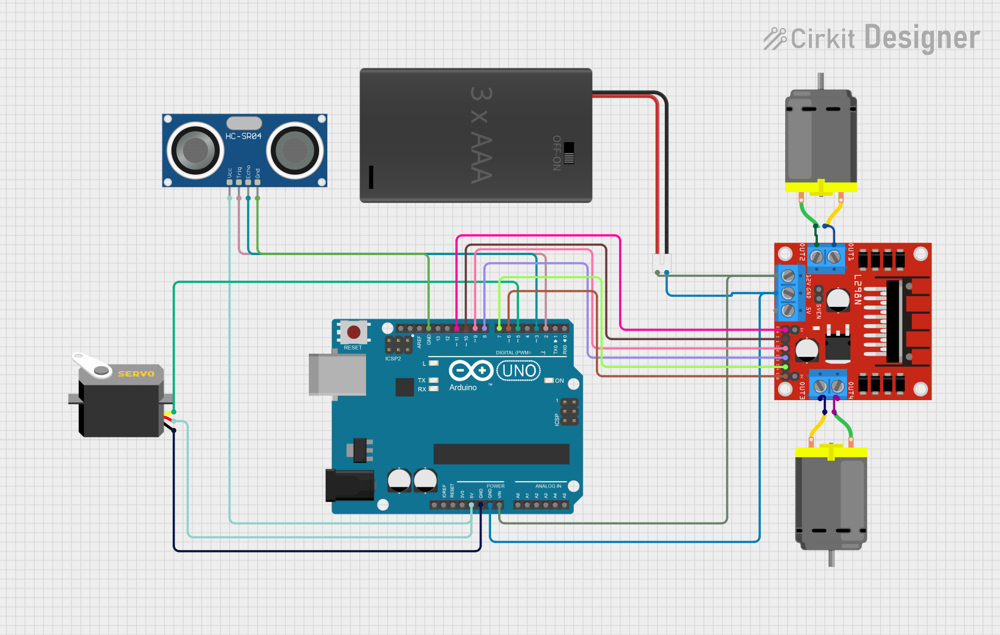
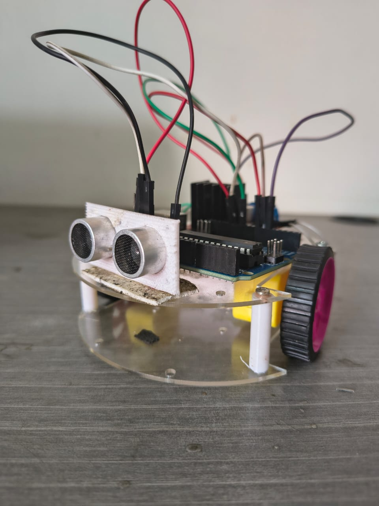

# 🤖 Obstacle Avoiding Robot with Arduino + Ultrasonic Sensor + L298N

An autonomous obstacle-avoiding robot built using Arduino Uno, HC-SR04 ultrasonic sensor, and an L298N motor driver. It detects obstacles using sound waves and intelligently navigates its environment.

---

## 🖼 Circuit Diagram

---

## 🖼 Demo Image

---

## 🎥 Demo Video

> 🔽 Click below to preview or download the demo video:

[▶ Watch Demo Video](demo_video.mp4)

---

## 📂 Files

- [`circuit_diagram.png`](./circuit_diagram.png): Circuit schematic of the robot setup.
- [`obstacle_avoiding_robot.ino`](./obstacle_avoiding_robot.ino): Arduino code for obstacle detection and motion control.
- [`demo_video.mp4`](./demo_video.mp4): Video demonstrating the working robot.
- [`demo.jpg`](./demo.jpg): Image showing the completed robot.

---

## 🛠 Components Used

- Arduino Uno
- HC-SR04 Ultrasonic Sensor
- L298N Motor Driver Module
- 2x DC Motors + Wheels
- Servo Motor (optional)
- AAA Battery Pack
- Jumper Wires
- Breadboard (optional)

---

## 🧠 How It Works

1. The ultrasonic sensor sends a pulse.
2. It calculates the distance by measuring the echo time.
3. If distance > 10 cm → robot moves forward.
4. If an obstacle is closer:
   - It moves backward.
   - Rotates to the right.
   - Continues checking until the path is clear.
   - Moves forward again.

---

## 🚀 Getting Started

1. Connect all components as per the circuit diagram.
2. Open the Arduino IDE and upload the sketch:
   - 👉 [`obstacle_avoiding_robot.ino`](./obstacle_avoiding_robot.ino)
3. Power the robot with the battery pack.
4. Watch it navigate autonomously!

---

